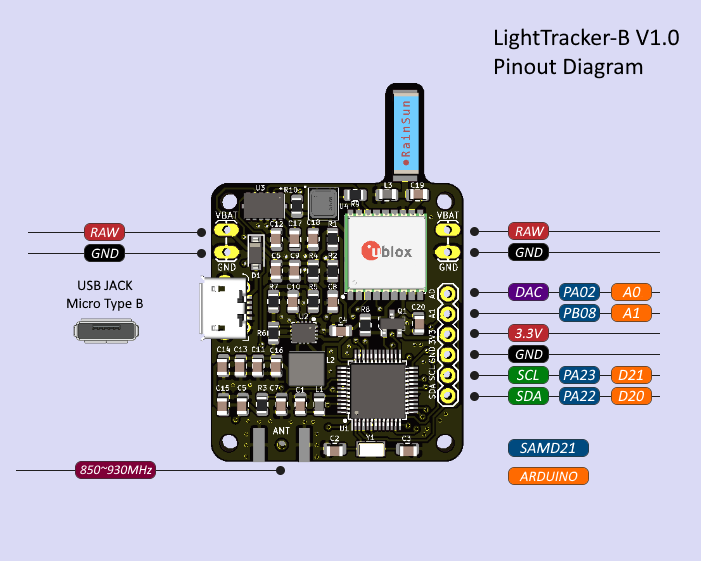
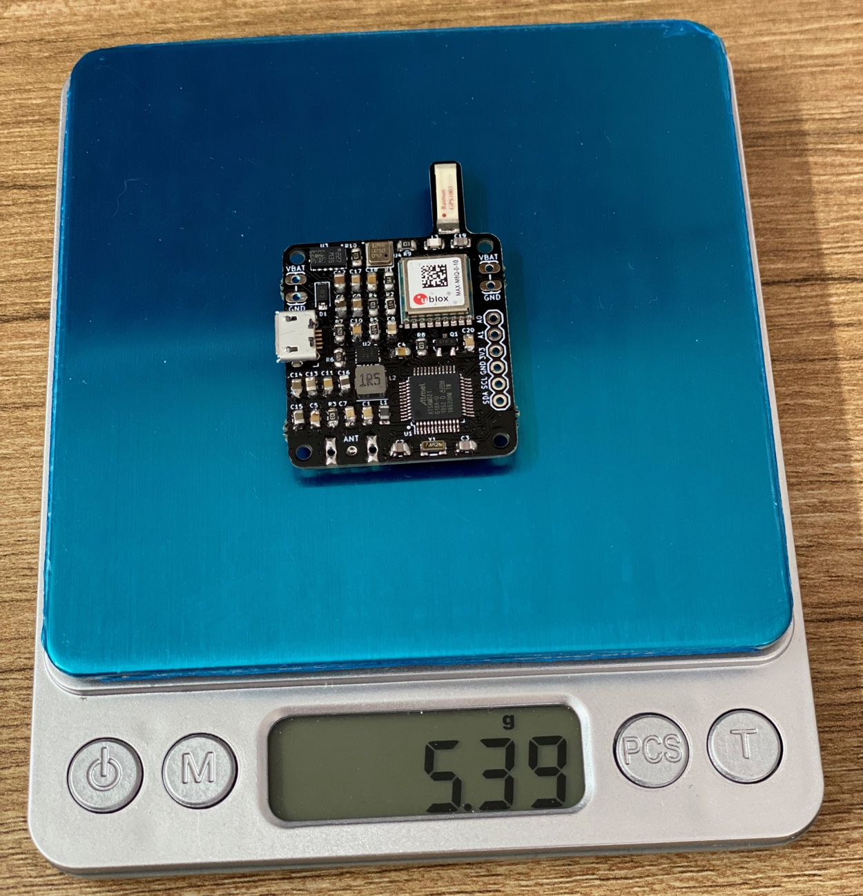

# 💬 LoRa Chat — off-grid browser chat with two LightTrackers

**Version:** firmware **v1.8** · 923.2 MHz (AS923 Thailand)

**Open the chat app:** **https://atominnovationth.github.io/TMX/**
*(enable Pages once: repo Settings → Pages → branch `main`, folder `/docs`)*

Chat with someone kilometers away with **no internet, no server, no installation**.
Plug a LightTracker into USB, click the link, pick a name — the app finds the
board, announces you to everyone in radio range, and you're chatting.

- **One click** — runs entirely in the browser (Chrome / Edge / Opera on desktop)
- **Verified link**: 923.2 MHz (AS923 Thailand), SF8 / BW125, ~1 s per message
- **Delivery receipts**: ⏳ sending → ✓ sent over radio → ✓✓ delivered (radio ACK)
- Live signal quality (RSSI / SNR) on every received message
- **Direction finder**: every message carries the sender's GPS position — the app
  shows live **distance and compass bearing** to the other person
  (`📍 4.2 km NNE ↗`), altitude difference, and their battery voltage
- **Mesh positioning** (fw 1.7): boards rebroadcast the signal strength of the
  peers they hear, so the app can triangulate a unit that has **no GPS of its
  own** from radio link strength, then pin that relative map onto real
  coordinates whenever any unit does have GPS (and auto-calibrate the
  distance model). Shown as hollow "~" markers with uncertainty halos.
- **Environment telemetry** (fw 1.8): each board also reports its own
  **temperature** and **barometric pressure** (BMP180) and an approximate
  **magnetic heading** (LSM303DLHC). Board temperature is the solar-charging
  health read (a unit in the sun runs above ambient); pressure gets a session
  trend arrow (a steady fall hints at weather turning); altitude is shown
  everywhere (absolute + relative to you), and the radar draws which way your
  board faces.
- **Presence heartbeat + silence alerts** (fw 1.8): every board beacons about
  once a minute whether or not it has a GPS fix, so the roster always shows who
  is alive with their battery voltage. The app turns a peer amber when it is
  *overdue*, posts a "gone quiet" line if it stays silent past ~5 min (then an
  "is back" line on recovery), flags a peer power-cycle ("restarted — possible
  power loss") and one-shot low-battery crossings — the brown-out signals a
  solar board sends but the app used to ignore.
- Clean light/dark chat UI, join announcements, unplug/reconnect handling

> **Use unique board names.** Peers are tracked by their display name, so two
> boards sharing a name will merge into one dot/row on the radar, roster and
> mesh. Give each board a distinct name (a labeled board sets its own).

## <a name="chat-setup"></a>Chat quick start

### 1. Flash both LightTrackers (one command each, prebuilt firmware included)

```bash
arduino-cli upload -b arduino:samd:mzero_bl -p /dev/cu.usbmodemXXXX \
  --input-file build/chat/lora-chat.ino.hex
```

> macOS Apple Silicon note: the stock Arduino avrdude is a 32-bit i386 binary
> that won't run. See [RECOVERY.md](RECOVERY.md) for the one-time x86_64 fix.
> Never use Homebrew avrdude 8.x with this board.

### 2. Enable GitHub Pages (once)

Settings → Pages → Source: **Deploy from a branch** → Branch: **main**,
folder: **/docs** → Save. The app then lives at
`https://atominnovationth.github.io/TMX/`.

### 3. Chat

Each person: plug a LightTracker into a laptop → open the app link in Chrome
or Edge → type a name → **Connect LightTracker** → pick *Arduino M0*. The app
announces "you joined" over the air; messages flow both ways with delivery
ticks. Range: km-scale line of sight with the stock antenna.

### How it works

```
Browser ⇄ Web Serial (USB) ⇄ LightTracker ⇄ 923.2 MHz LoRa ⇄ LightTracker ⇄ Web Serial ⇄ Browser
```

- `lora-chat/lora-chat.ino` — transceiver firmware (same sketch on both boards):
  NDJSON over USB serial; compact binary frames over the air with magic-byte
  filtering, per-boot random sender IDs, duplicate suppression,
  listen-before-talk (CAD + random backoff), and ACK + one retransmit.
  Chat and join frames carry a 12-byte position trailer (GPS lat/lon/alt,
  satellite count, battery); the header GPS pill shows your own fix status. The
  join frame also carries a tiny client/app profile (browser · OS · desktop) so
  each side can see what the other is chatting from. A periodic presence beacon
  (~60 s, fix or no fix) additionally carries the board's temperature, pressure
  and magnetic heading (fw 1.8) plus a neighbour-RSSI slice for mesh positioning.
- `docs/index.html` — the whole app in a single file. Vanilla JS, zero
  dependencies, zero external requests, works offline once loaded.

**Limits (by design):** text only, ≤180 chars/message, half-duplex (~2.5 kbps
raw), 2+ participants share one channel, no encryption (don't send secrets).
Check your local regulations for the 920–925 MHz ISM band; the firmware
defaults comply with AS923 Thailand (16 dBm).

**Restore the original tracker firmware anytime:** flash
`build/tx/lora-asset-tracker-tx.ino.hex` or `build/rx/lora-asset-tracker-rx.ino.hex`
with the same upload command.

---

**Retired Product:** This product has been retired from our catalog and is no longer for sale. Check out [LighTracker 1.1](https://github.com/lightaprs/LightTracker-1.1)

# LightTracker

LightTracker is one of the most affordable, smallest, lightest, powerful and open source LoRa and LoRaWAN trackers available. It makes tracking pico balloons, weather balloons, model rockets, RC aircraft, and anything else that flies simple and easy.
It is able to report location, altitude, temperature and pressure to the internet (LoRaWAN networks such as Helium and TTN) or direct to another LoRa radio module with a solar panel/super capacitors or just 3xAAA batteries.
Because LightTracker is open source you can add your own custom sensors via I2C pins.

LightTracker has been retired from our catalog and is no longer for sale. Checkout following alternatives:

**LighTracker 1.1:** https://github.com/lightaprs/LightTracker-1.1

**LightTracker (LoRa APRS) 1.1 - 433MHz:** https://github.com/lightaprs/LightTracker-1.1-433

**LightTracker (LoRa APRS) Plus 1.0 - 433MHz:** https://github.com/lightaprs/LightTracker-Plus-1.0/

**LightAPRS Tracker - 144 MHz:** https://github.com/lightaprs/LightAPRS-1.0



**Important :** LightTracker uses unlicensed ISM radio bands which does not require any license to operate. So everyone can use LoRa & LoRaWAN modules.


## Basic Features

- **Software** : Open Source
- **Weight** : 5.4 grams
- **Dimensions** : 32 mm x 47 mm
- **IDE** : Arduino
- **Platform** : ARM Cortex-M0 (Arduino M0)
- **CPU** : ATSAMD21G18
- **Flash** : 256 kB
- **Ram** : 32 kB
- **Operating Frequency** : 48 Mhz
- **Operating Voltage** : 3.3 Volt
- **Input Voltage** : 2.7 (min) - 16 (max) Volt via usb or VBat pin
- **Sensor** : BMP180 (pressure and temperature), LSM303DLHC (3D Compass and Accelerometer)
- **Power Consumption (Sleep)** : ~1 mA
- **Power Consumption** : ~7 mA
- **LoRa Radio Module** : [EBYTE E22-900M22S](https://www.ebyte.com/en/product-view-news.aspx?id=437) (SX1262)
- **LoRa Operating Frequency** : 850~930MHz (configurable by code)
- **LoRa Max Power** : 22dBm (configurable by code)
- **LoRa Power Consumption (TX)** : ~110 mA (22dBm)
- **GPS** : Ublox MAX-M8Q (GPS-GLONASS)
- **GPS Antenna Gain** : 4.3 dBi
- **Extended Pins** : I2C, 2x Analog, 1x DAC



## Configuration

To programme LightTracker, all you need is a micro usb (B type) cable, a few installations and configurations.

### 1.Install Arduino IDE

Download and install [Arduino IDE](https://www.arduino.cc/en/Main/Software). If you have already installed Arduino, please check for updates. Its version should be v1.8.13 or newer.

### 2.Configure Board

- Open the **Tools > Board > Boards Manager...** menu item as follows:


- Type "Arduino SAMD" in the search bar until you see the **Arduino SAMD Boards (32-Bits Arm Cortex-M0+)** entry and click on it.


- Click **Install** .
- After installation is complete, close the **Boards Manager** window.
- Open the **Tools > Board** menu item and select **Arduino SAMD Boards (32-Bits Arm Cortex-M0+) -> Arduino M0** from the the list as follows:


### 3.Copy Libraries & Compile Source Code

You are almost ready to programme LightTracker :)

- First download the repository to your computer using the green "[Code -> Download ZIP](https://github.com/lightaprs/LightTracker-1.0/archive/refs/heads/main.zip)" button and extract it.
- You will see more than one Arduino project optimized for different use cases. For example if you are planning to use LightTracker for a pico balloon project, then use "[lorawan-otaa-pico-balloon-tracker](lorawan-otaa-pico-balloon-tracker)" folder or if you want to track your assets, vehicles, etc. then use "[lorawan-otaa-asset-tracker](lorawan-otaa-asset-tracker)" folder.
- You will also notice some folders in the "libraries" folder. You have to copy these folders (libraries) into your Arduino libraries folder on your computer. Path to your Arduino libraries:

  **Windows** : This PC\Documents\Arduino\libraries\
 
  **Mac** : /Users/\<username\>/Documents/Arduino/libraries/

- Copy all of them into your Arduino libraries folder as follows:


- Then open the relevant sketch file (*.ino) with Arduino IDE and change your settings as described in Wiki pages and save it.
- Click **Verify**

### 4.Upload

- First attach an antenna to your tracker as if described in [Antenna Guide](https://github.com/lightaprs/LightTracker-1.0/wiki/Antenna-Guide) LoRa radio module may be damaged if operated without attaching an antenna, since power has nowhere to go.
- Connect LightTracker to your computer with a micro USB cable.
- IYou should see a COM port under **Tools->Port** menu item. Select that port.


- Click **Upload**
- Your tracker is ready to launch :)

## Support

If you have any questions or need support, please contact support@lightaprs.com

## Wiki

### General

* **[F.A.Q.](https://github.com/lightaprs/LightTracker-1.0/wiki/F.A.Q.)**
* **[Antenna Guide](https://github.com/lightaprs/LightTracker-1.0/wiki/Antenna-Guide)**
* **[Tips & Tricks for Pico Balloons](https://github.com/lightaprs/LightTracker-1.0/wiki/Tips-&-Tricks-for-Pico-Balloons)**
* **[Supported Protocols and Digital Modes](https://github.com/lightaprs/LightTracker-1.0/wiki/Supported-Protocols-and-Digital-Modes)**

### LoRaWAN

* **[Adding Device on Helium Console](https://github.com/lightaprs/LightTracker-1.0/wiki/Adding-Device-on-Helium-Console)**
* **[Cayenne myDevices Integration with Helium Console](https://github.com/lightaprs/LightTracker-1.0/wiki/Cayenne-myDevices-Integration-with-Helium-Console)**
* **[Adding Helium Device on Cayenne myDevices](https://github.com/lightaprs/LightTracker-1.0/wiki/Adding-Helium-Device-on-Cayenne-myDevices)**
* **[How to Customize Cayenne Dashboard](https://github.com/lightaprs/LightTracker-1.0/wiki/How-to-Customize-Cayenne-Dashboard)**
